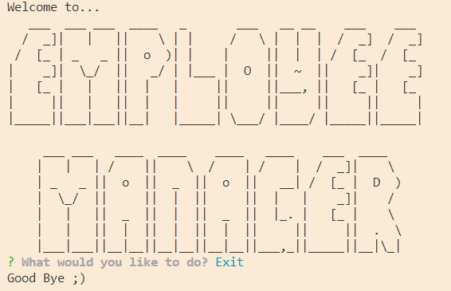

# Employee Manager

  

## Description

A basic CLI used to  manage an employee database.

Link to [video demonstrating functionality](https://drive.google.com/file/d/1eTFVM4cbEBIW_FnJ8pjryF0B9RJyrrNu/view?usp=sharing)

## Table of Contents

* [Installation](#installation)
* [Usage](#usage)
* [Contributing](#contributing)
* [License](#license)
* [Questions](#questions)

## Installation

Run `npm init` to install dependencies.

## Usage

Application is invoked with command: `node app.js` or `npm start`.

## License

MIT License

Copyright (c) 2020 Clarissa

## Contributing

When contributing to this repository, please first discuss the change you wish to make via issue, email, or any other method with the owner(s) of this repository before making a change.

## Questions

For any questions the author can be contacted at:

GitHub: @[clarissareeve](https://github.com/clarissareeve)

Email: clarissa.reeve@gmail.com

